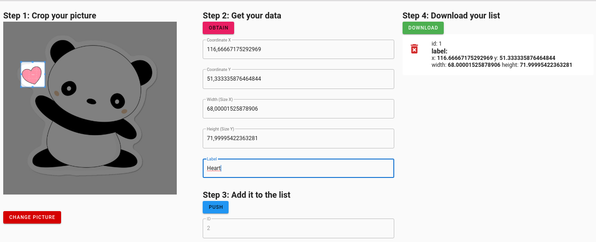

# Report IHM lab-1

> Burgener François, Póvoa Tiago

## Getting started

You can go inside

> /app-ihm/dist

And serve the  files in a live server (for example VS Code Live Server).

As an alternative, you could put it on a web server. A simple web static server is more than enough.

### Run it for dev purposes

We made a Vue.js application. In order to run it on dev you'll have to go here:

> /app-ihm

and run the following:

```
$ npm init
$ npm serve
```

it will install the dependencies and run a hot reload server.

# Overview of the app

You first arrive here


Drag and drop your picture, then press next. You can alternatively just click the grey box and use the file explorer.


You'll arrive to the next page. Let's see what we can do.



1. Crop your picture by clicking and sliding on the picture
2. Press the button to get the data.
   1. Add your label, in this example we have the  word "Heart"
3. When you are happy with your selection, you can push it with the blue button to add it to the list.
   1. Alternatively, you can remove it by pressing the red trash icon (signifier).
   2. You can edit back the selection by pressing on the data row (right list)
4. Then finally, press the green button download.


Chose the filename and you're done.

## Donald Norman's Principles of design 

### Visibility 

In the first page, we used the grey area box to signify that you can drag and drop. 

In the second page:

* the red button tells the user that this action is dangerous (getting back might make him lose his current work)
* Since we read left to right, we put the different steps in that order.
* The pink button is here to be the more visible since this action is important and required so the user finds it quickly.
* The blue one signifies "next step", or in this case push. The reason is that the blue is often associated with links
* Finally we used the green button (= success) to express the end of the flow.

To allow the user to remove from the list a data row, we put a trash icon (signifier).


### Feedback 

To help with the feedback sensation, we put a event on blur on the text fields. As soon as you leave them, the blue selection square will be directly updated with the new values you entered. 

Also, the stack in the right is live updated as soon as you push data onto it. It helps the user to see the result of his action. The fields are also immediatly emptied and the ID field is set to the next value so you know you're working in a new data row.

### Consistency 

As we seed previously, we used colors and one icon to help with this aspect.

### Non-destructive operations 

To improve this aspect we added the following features:

* You can manually change the values in the field once you made a selection
* You can delete your selection if you are not satisfied
* If you press the button to change the picture and get back to the first page, you're asked to confirm before the action is done. So we give you a chance to cancel a miss input.
* We added this exact same behavior in the download button. Both use a "modal".

### Scalability

As you can see here, the app is responsive. 


It would work nicely in a tablet. And Okayish in a smartphone (not very practicle to scroll).

### Discoverability

We added the step texts to help with this aspects. 

### Reliability

You could press all the button in a random order and see what they do without fearing the consequences.